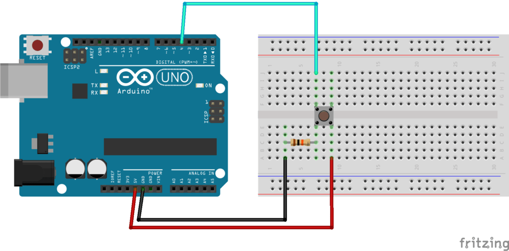

# pull down
pull down은 아두이노에서 pull up resistor를 사용했던 방식 처럼 사용을 할 수는 없다  

즉 코드로 직접 INPUT_PULLUP 이런식으로 상수를 사용해서, 내부적으로 pull-up 레지스터를 사용할 수가 없다고 한다 

그래서 서킷에 직접 구현을 해야한다고 함(pull down의 경우)   

버튼의 한쪽 핀은 VCC 에 연결을 하고 다른 한쪽은 디지털 핀에 연결  
이제 디지털 pin이 연결된 라인의 반대편에 10K 저항을 달아서 GND에 연결하게 된다   

pulldown 은 pullup 과는 *반대*로 디지털 핀 연결한쪽에 **저항 및 GND**로 연결, 다른 핀은 VCC 연결

pullup은 *디지털 핀 연결한 쪽*에 **저항과 VCC 연결**을 하고 반대쪽 핀을 GND에 연결한다

| pull종류 | + | - |
| --- | --- | --- |
| pull-down | VCC | 저항 + GND, 그리고 디지털 핀 |
| pull-up |  저항 + VCC 그리고 디지털 핀 | GND |




코드에서는 `pinMode(pin, INPUT)` 으로 사용을 하면 되고, 기본값은 LOW 가 된다.   
버튼이 Pressed가 되면 시그널이 HIGH 로 점프하게 된다   

```
       press   release
        ┏━━━━━━━━┓
        ┃        ┃
        ┃        ┃
0   ━━━━┛        ┗━━━━━━━━
```

