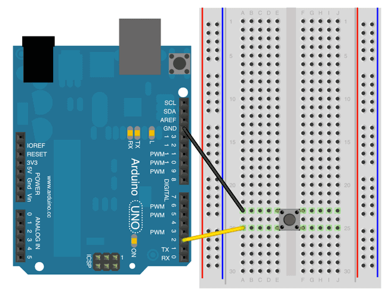
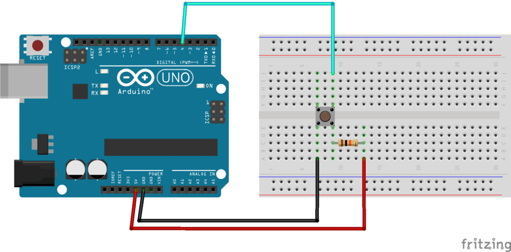

# button pull-up 셋팅

4핀의 다리 중에 한 부분을 GND 에 연결하고 다른쪽 한 쪽은 보드의 PIN에 연결   
(서로 위치가 바껴도 문제는 없는 듯 하다) 반대편은 2개 핀은 그냥 연결이 안 된 상태로 둔다  

pull up 상태는 계속 5v 신호가 올라가 있는 경우이고  
여기에서 press 를 하게 되면 pulse가 떨어지게 된다. 다시 버튼을 떼게 되면 다시 5v로 올라오게 됨   

```
        press   release
5v  ━━━━┓        ┏━━━━━━━━
        ┃        ┃
        ┃        ┃
        ┗━━━━━━━━┛
```

 // Keep in mind the pull-up means the pushbutton's logic is inverted. It goes

 // HIGH when it's open, and LOW when it's pressed. Turn on pin 13 when the

 // button's pressed, and off when it's not:



내부적으로 internal pull up resistor가 되어 있다. (20k ~ 50k의 옴) 그래서 시그널을 HIGH로 유지 시켜준다   
그래서 `pinMode(pin, HIGH)` 에서 HIGH / LOW 말고도 INPUT_PULLUP 이 가능

코드로는 
```cpp
setup() {
    pinMode(pin, INPUT_PULLUP);  // pull-up 으로 셋팅
}
```

## (참고로) 직접 pull up상태 만들기 

10k Ohm(옴) 저항을 달아서 직접 만들 수도 있다  
그라운드에 연결된 반대편의 pin에 저항을 10k 로 달아 준다음에 이를 VCC에 연결해준다,   
그리고 vcc의 반대편의 같은 라인의 핀은 digital pin 에 연결되게 된다   

이렇게 되면 INPUT_PULLUP 이 필요 없게 되고, 그냥 INPUT 로 셋팅을 할 수가 있다 
`pinMode(pin, INPUT)`

이렇게 되면 디폴트 셋팅이 HIGH 이고, INPUT_PULLUP 처럼 셋팅 했던 그대로 사용이 된다  




