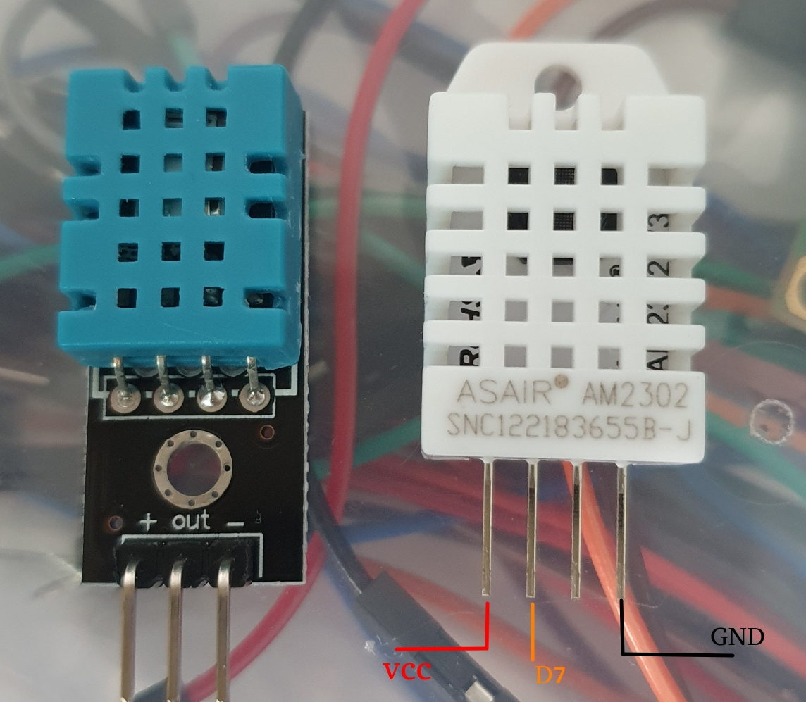

# dht11 dht22 온 습도 센서

DHT11 친절(?)하게 프린트 되어 있음    
```
 |     |     |   
VCC  Data  Ground   
```

DHT22 같은 경우는 핀이 4개지만..   
DHT22 는 핀이 한개가 (왼쪽에서 3번째) 더 있는데 ... 사용 안한다 (NC - No Connection and Not Used)   

GND, VCC 를 연결해주고 디지털 핀을 연결해준다  
```
 |     |    |     |   
VCC  Data  NC   Ground   
```

Data는 디지털 핀 out으로 해주면 된다.   




### DHT22 spec

- Operating Voltage: 3.5V to 5.5V   
- Operating current: 0.3mA (measuring) 60uA (standby)   
- Output: Serial data   
- Temperature Range: -40°C to 80°C  
- Humidity Range: 0% to 100%  
- Resolution: Temperature and Humidity both are 16-bit  
- Accuracy: ±0.5°C and ±1%  


