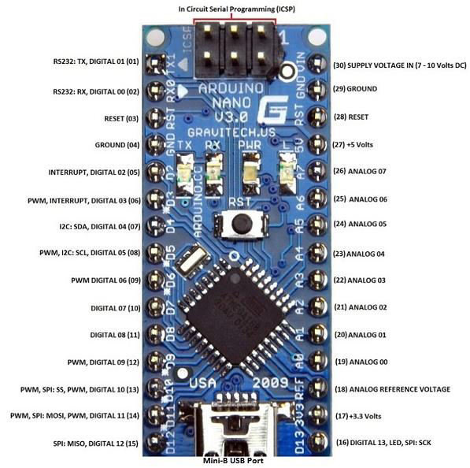

# nrf
nRF24L01  

- 2.4 ~ 2.5Ghz ISM band 에서 작동  
- SPI port 사용  

두 종류의 모델이 있는데 하나는 안테나 내장형, 또 다른 하나는 외부 안테나 연결용이 있다   

<내장 안테나>   
- 안테나 내장형은 더 저렴하고 간단하게 구현하기 편하다   
- 2~5m 정도는 괜찮게 작동하는 듯 하다  
- nf 시그널은 사람이 막고 있어도 방해가 되어 막으면 송/수신이 불가 할 수 있음

<외부 안테나>  
- 외부 안테나 용은 조금 더 가격이 있지만 그래도 저렴한 편  
- 꽤 먼거리에서도 통신이 가능하고 벽, 장애물도 잘 통과해서 송수신 가능  

SPI 통신핀을 사용하는 SCK 부분을 아두이노 나노의 D13번 핀에 연결 (SPI)   

> D13핀은 보드 내의 LED 및 SPI; SCK에 사용됨  

~~CE, CSN, M0, M1 등은 digital pin에 연결해준다~~  
~~M0는 디지털 pwm 핀에 연결  나머지는 그냥 digital pin에 연결해주면 되는 듯 하다~~

rf24 라이브러리를 설치 한다   
라이브러리 검색 시 nRF24에서 제공하는 library를 선택해서 설치를 해주면 된다  

## nRF 핀 연결 시

주의할 점은 3.3V에 연결을 해야한다. 3.9V까지 지원이 되므로 **5V 에 연결하면 안됨**  

어댑터가 있는데 어댑터에는 핀들을 쉽게 꽂을 수 있게 되어 있을 뿐 아니라   
3.3v 레귤레이터가 달려있어서~ 5V 로 입력을 줘도 된다 (어댑터 사용 시)   

> 하지만 아두이노 nano 사용시에는 어댑터에 3.3v로 연결해준다. 5V로 연결을 하면 작동을 안함  

중요한 그냥 digital 핀에 연결하면 작동을 안한다.   
처음에는 SCK 핀으로 spi 관련 부분만 연결하면 되는 줄 알았으나,   
spi 관련된 핀이 MOSI, MISO 등이 더 있어서 맞는 digital pin에 연결을 해야한다   

SCK, MISO, MOIO 가 그 예이다. 

먼저 아두이노 나노 기준으로 설명  
SCK핀은 --- D13   
MO핀은 --- D11  
(MOSI : Master Out Slave In - Master 즉, 아두이노에서의 output이 된다, Slave 인 nRF24L01의 input)   

MI핀은 --- D12 
(MISO : Master In Slave Out - nRF24L01 의 output, 아두이노의 input이 됨)  

CE핀은 --- D9  
CSN핀은 --- D8  

아주 중요하다, 특히 SPI 핀들이 제대로 연결이 안되면 작동을 안 한다. 

다른 MCU 보드로 연결을 할 때에는 해당 보드의 핀 맵을 보면서 참고해서 연결하면 되겠다

## 아두이노 uno
아두이노에는 5v 를 연결하는데 *5v를 직접 연결하는 것이 아닌* 어댑터에 연결해준다   

> 3.3v를 넣어주면 작동을 안한다. 물론 어댑터에 연결했을 경우이다.  
> (나노에서는 어댑터에 5V를 넣어주면 오히려 작동을 안하는데, 흠..)  

아두이노 우노 기준으로 설명  
SCK핀은 --- D13   
MO핀은 --- D11 (MOSI)  
MI핀은 --- D12 (MISO)  
CE핀은 --- D9  
CSN핀은 --- D8  

> 아두이노 나노와 동일하다

## 두개 의 MCU로 통신
통신을 할 경우에는 포트가 달라지므로 시리얼포트를 잘 설정해준다. 

`/dev/ttyACM0` 으로 하나가 잡히고, `/dev/ttyUSB0` 로 잡힌다.  

처음에 example 코드인 GettingStarted 코드를 실행하게 되면  
하나의 장치의 어드레스는 0, 다른 하나는 1 을 해주고 (서로 다르게)   

그리고 하나의 장치는 T를 눌러서 trasmit을 하고 , 다른 하나는 R을 눌러서 receive를 하면 된다   

## 라이브러리 
라이브러리 rf24를 아두이노IDE 에서 검색 후 설치해준다   

> 현재는 rf24로 구현하고 있지만, 라디오헤드 라이브러리도 나중에 볼 필요가 있을 듯하다  

- RadioHead 라이브러리  

[RadioHead](http://www.airspayce.com/mikem/arduino/RadioHead/)   
위의 링크에서 다운을 받는다   

example에서  RadioHead 의 nrf24 부분의 프로그램을 참고한다  

> radiohead 라이브러리는 비교적 간단하고 다양한 모듈을 지원하는 듯 하다

[좀 더 설명은 DroneBot Workshopt 참고하기](https://www.youtube.com/watch?v=lhGXAJj8rJw)

