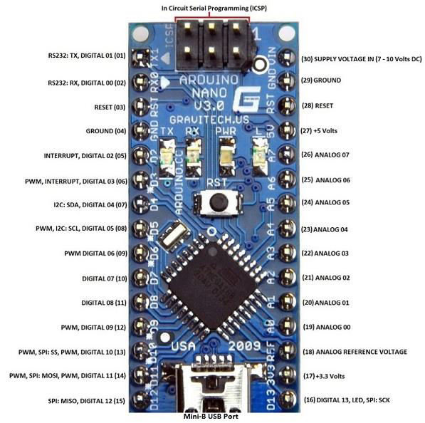

# nrf
nRF24L01  

SPI 통신핀을 사용하는 SCK 부분을 아두이노 나노의 D13번 핀에 연결 (SPI)   

> D13핀은 보드 내의 LED 및 SPI; SCK에 사용됨  

~~CE, CSN, M0, M1 등은 digital pin에 연결해준다~~  
~~M0는 디지털 pwm 핀에 연결  나머지는 그냥 digital pin에 연결해주면 되는 듯 하다~~

rf24 라이브러리를 설치 한다   
라이브러리 검색 시 nRF24에서 제공하는 library를 선택해서 설치를 해주면 된다  

## nRF 핀 연결 시

주의할 점은 3.3V에 연결을 해야한다. 3.9V까지 지원이 되므로 **5V 에 연결하면 안됨**  

전원관련해서 어댑터가 있는데 여기에도 5V로 연결을 하면 작동을 안함  
어댑터의 역할은 아무래도 nRF 모듈이 빵판에 꼽기가 힘드므로 나온 말그대로 어댑터의 기능인듯  

> 어탭터에 5v로 연결하는 것으로 알려주는 곳도 있는데, 5V로 하면 작동을 안하고 3.3V 일 때 작동함 

중요한 그냥 digital 핀에 연결하면 작동을 안한다.   
처음에는 SCK 핀으로 spi 관련 부분만 연결하면 되는 줄 알았으나,   
spi 관련된 핀이 MOSI, MISO 등이 더 있어서 맞는 digital pin에 연결을 해야한다   

SCK, MISO, MOIO 가 그 예이다. 

먼저 아두이노 나노 기준으로 설명  
SCK핀은 --- D13   
MO핀은 --- D11 (MOSI)  
MI핀은 --- D12 (MISO)  
CE핀은 --- D9  
CSN핀은 --- D8  

아주 중요하다, 특히 SPI 핀들이 제대로 연결이 안되면 작동을 안 한다. 

다른 MCU 보드로 연결을 할 때에는 해당 보드의 핀 맵을 보면서 참고해서 연결하면 되겠다

