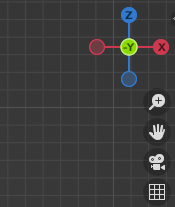
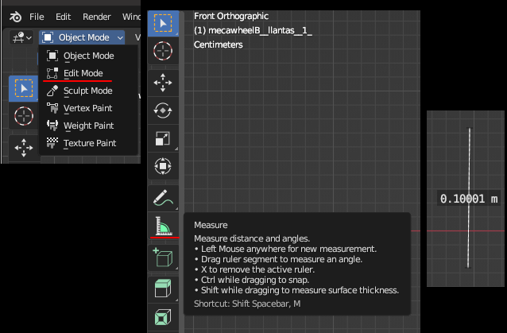
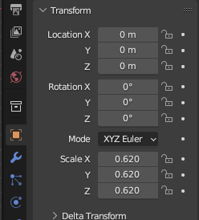

# dae 파일 크기 줄이기 scale down
로봇의 특정 부분을 meshes로 표현을 해줄 수가 있는데   
urdf 파일에서 visual 태그 안에 geometry 부분에 mesh 라는 이름으로 넣어준다   
예를 들면
```xml
...생략
<link name="my_link1">
    <visual>
        <origin xyz="0 0 0" rpy="0 0 0"/>
        <geometry>
            <mesh filename="package://my_pkg/meshes/my_meshes.dae" />
        </geometry>
        ... 생략
    </visual>
... 생략
</link>
```
이런식으로 만들어지게 되는데 , 원래 geometry에 `<cylinder length="0.03" radius="0.05" />` 이런식으로 들어가는 것을  
mesh 파일을 대체해주면 rviz나 gazebo 에서 멋지게 나오게 된다   

> 물론 dae 파일은 만들 줄은 모르고 인터넷으로 구해야 함

## ros dae stl
ros urdf 에서는 dae 파일과 stl 파일을 지원하는데 그 중 dae 파일을 살펴보면   
확장자는 .dae 이고 이름은 *Collada* 라고 불린다 


## blender tool 프로그램을 이용
해서 스케일을 줄이거나 크게할 수가 있다.   

내가 만든 것이 아니기 때문에 내 로봇의 사이즈에 당연히 안 맞는다. 바퀴를 예를 들면 바퀴의 diameter에 맞춰서 사이즈를   
조절하면 좋은데 일단 내가 할 줄 아는 선에서 야매급으로 정리함


먼저 특정 편집하고자 하는 dae 파일을 복사후 (백업) blender 프로그램에서 import를 해준다   
File->Import 에서 Collada 파일을 클릭   

sacle로는 1.0 기준으로 줄일 수가 있는데 줄이거나 커지거나 한다   

먼저 상단에서 원형(바퀴)를 내려다 볼 수 있게 뷰 position을 바꿔주는데 오른쪽 상단의 x-z-z 를 클릭하면 바뀜    
   

먼저 왼쪽 상단의 Object Mode 툴에서 Edit Mode로 변경을 해주고 왼쪽 툴 중에 Measure 를 선택해준다   
그리고 마우스를 드래그를 해주면 길이를 측정할 수가 있다.   
   

이 상태에서 오른쪽 Transform 탭에서 scale을 선택하고 X,Y,Z 를 축소 하거나 확대해서 원하는 크기를 맞춰준다  
   


> measure 툴로 선을 그었을 때 길이가 나오므로 해당 길이로 0.1000M 식으로 나오므로 (100mm) 대략적으로 맞춰준다 

이런식으로 몇번 해주면 원하는 크기로 맞출 수가 있다  

File->Export 에서  Collada 파일로 선택 후 원하는 파일명으로 내보내기를 해서 저장을 시켜준다  

urdf의 파일에서 해당 .dae 파일 경로를 넣어주면 원하는 메쉬 파일을 볼 수가 있다


