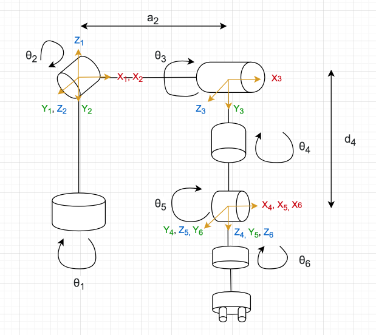

# forward kinematics
Forward Kinematics는 로봇 키네마틱 공식을 통해서 manipulator (로봇팔)의 end-effector 라고 불리는   
가장 마지막의 gripper 부분까지의 거리와 위치를 계산하게 되는 것을 말한다  

여러개의 links 와 joints 에 여러 각도의 자유도를 가지고 있는 로봇팔의 position과 orientation을 찾는 것

## DH parameters
Denavit-Hartenberg 파라미터: 4개의 파라미터가 있음. a, 알파, d, 세타  

a (또는 r): length of the common normal. Assuming a revolte joint, this is the radius about previous 'Z'    
: offset이 만들어진다. (그 전의 joint와 간격이 떨어지게 된다) -- 0이면 joint 위에 joint가 생기게 됨   
알파: angle about common normal, from old 'Z' axi to new 'Z' axis   
d: offset along previous 'Z' to the common normal    (distance between jointx(1) and jointx(2))   
theta: angle about previous 'Z', from old 'X' to new 'X'   


Denavit-Hartenberg Parameters (DH params)

[4개파라미터 확인할 수가 있음- 조금 느림](https://demonstrations.wolfram.com/DenavitHartenbergParametersForAThreeLinkRobot/)


## set up the axes
Z-axis: Z축은 revolute joint 로 회전을 할 때의 축이 된다   
X-axis: X축은 common normal 이면서 이전의 Z축과 현재의 Z축 간의 가장 짧은 거리가 된다 (orthogonal line)   
Y-asix: Y축은 다른 2개의 축을 구했다면 쉽게 할 수 있는데 right hand rule을 따른다(오른쪽을 총(?)모양을 했을 때의 중지손가락 방향)   


## DH table
| i | αi - 1 | αi - 1 | di | θi |
| --- | --- | --- | --- | --- |
| 1 | 0 | 0 | 0 | θ1 |
| 2 | -π /2 | 0 | 0 | θ2 |
| 3 | 0 | α2 | 0 | θ3 |
| 4 | -π /2 | 0 | d4 | θ4 |
| 5 | π /2 | 0 | 0 | θ5 |
| 6 | -π /2 | 0 | 0 | θ6 |

이 DH table은 이 사진 다이어그램에 적용된 것임-- 참고

   

위의 경우에는 2번째 joint에서 부터 π/2 (1.57) 로 회전을 함, 3번 조인트는 2번과 동일한 방향으로 회전이어서 0  
그 이후 4, 5, 6 조인트에서는 서로 각기 다른 방향으로 회전    

알파 부분은 조금(?) 알겠지만.. d distance는 잘;;; 모르겠다 ㅠ  
일단 general idea 만이라도 얻자!  

이제 frame to frame 으로 matrix에 구할 수가 있는데   

notebook 파일을 참고하자.   
>  (frame to frame 에 대한 행렬이 있고   
최종적으로 나오는 r (rotation) 과, Px, Py, Pz 의  포지션이 행렬로 있다 )  


## ros에서는 tf 를 통해서 쉽게 사용할 수가 있다
tf를 이용해서 사용할 수가 있는데 복잡한 kinematics를 알아서 계산해주는 것
URDF 를 이용해서 

행렬에서 T0 에 해당해는 0 프레임이 base_link라고 보면 된다   

각 링크간에 echo 로 볼 수가 있다 
예
```
rosrun tf tf_echo link1 link2
```

결과 출력
```
At time 1686724702.557
- Translation: [0.000, 0.000, 0.000]
- Rotation: in Quaternion [0.500, 0.500, 0.500, -0.500]
            in RPY (radian) [3.142, -1.571, 1.571]
            in RPY (degree) [180.000, -89.988, 89.988]
```

각 joint에 대한 것을 보려면 joint_states 토픽을 
```
rostopic echo /joint_states -n1
```


## moveit


[좀 더 정리해보기 다시 보기](https://www.youtube.com/watch?v=_pIyXGRXMWY)
