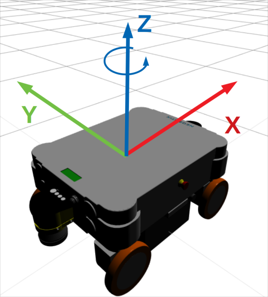

# Wheeled mobile robots
Wheeled mobile robots 에는 Holonomic (omnidirectional) 또는 nonholonomic 방식이 있다.   


Holonomic: omniwheels 또는 mecanum wheels 가 있다. 옆으로 이동이 가능하다 

Nonholonomic: 자동차, 전통적 방식의 휠 등이 있고, 옆으로 움직일 수가 없다

## chassis의 속도
먼저 로봇의 x axis, y axis, 헤딩방향인 angular z axis가 있는데 (중심에서 z축)   
이를 통해서 chassis의 속도를 구하게 된다. **휠의 속도는 아니다**



위의 coordinate를 통해서 q = (알파, x, y) 가 되게 된다. (샤시의 속도(twist를 𝑣b) 로 식으로 표시하면..)   
𝑣b = (ωbz, 𝑣bx, 𝑣by) 

> 𝑣는 vee 로 발음, (v와 비슷) vector를 의미할 경우 많이 사용   
ω 는 오메가, 그리스소문자, angular velocity를 지칭할 때 많이 사용


## Kinematic model
4바퀴의 mecanum 의 모바일 로봇 kinematic model  


𝑢 는 휠의 driving 속도의 대한 vector  
𝑟 은 휠의 radius   
𝑙 과 𝑤 은 샷시 (chassis)의 dimensions   
𝑙 은 휠의 중점에서 x axis 로 로봇 샤시 중심까지의 거리 
--(휠베이스라고 생각할 수 있는 휠(front) 중점과 휠(rear)의 거리의 반절이 됨)    

𝑤 휠의 중점에서 y axis로 로봇 샤시 중심까지 거리   
--(front나, rear를 y axis기준으로 휠(left)의 중점에서 휠(right) 중점까지 거리의 반절)

𝛾 는 슬라이딩을(free sliding occurs) 하는 각도   
free sliding은 diagonal 움직임. 즉, 대각선으로 움직이는 것을 의미하는 듯 하다   


## 파이썬 코드로 키네마틱을 function으로 구현

```
    ┏    ┓       ┏             ┓   
    ┃ u1 ┃       ┃ -l - w 1 -1 ┃ ┏     ┓    
    ┃ u2 ┃       ┃ 1 + w  1  1 ┃ ┃ wbz ┃   
u = ┃ u3 ┃ = 1/r ┃ l + w  l -1 ┃ ┃ ubx ┃   
    ┃ u4 ┃       ┃ l - w  1  1 ┃ ┃ uby ┃   
    ┖    ┚       ┖             ┚ ┖     ┚   
```

```py
def twist2wheels(wz, vx, vy):
    l = 0.500/2
    r = 0.254/2
    w = 0.548/2
    H = np.array([[-l-w, 1, -1],
                  [ l+w, 1,  1],
                  [ l+w, 1, -1],
                  [-l-w, 1,  1]]) / r
    twist = np.array([wz, vx, vy])
    twist.shape = (3,1)
    u = np.dot(H, twist)
    return u.flatten().tolist()

# numpy등이 필요
import rospy, numpy as np
from std_msgs.msg import Float32MultiArray

rospy.init_node('make_turn', anonymous=True)
pub = rospy.Publisher('wheel_speed', Float32MultiArray, queue_size=10)
rospy.sleep(1)

u = twist2wheels(wz=1.5, vx=1, vy=0)
msg = Float32MultiArray(data=u)
pub.publish(msg)
rospy.sleep(1)
stop = [0,0,0,0]
msg = Float32MultiArray(data=stop)
pub.publish(msg)

```

예제에 사용된 로봇의 휠 지름은 254mm, 위의 그림을 참고하자..

> l, r, w를 2로 나눈것은 위의 그림을 보면 더 이해가 쉽다.  
robot의 휠베이스라고 할 수 있는 robot's length 부분의 길이를 사용을 하는데   
로봇 kinematic model을 보게 되면 *l* 의 움직임은 로봇 중심에서 휠 중심까지의    
움직임이니깐 robot's length (마치 휠베이스)에서 2를 나눠주게 되고,    
이는 w와, radius와도 같은 방식이니깐 다들 반절을 사용해서 나눠준다   

처음 np.array()로 만든 H 는 2차원 배열로 만들어 준다.   
각각의 배열에 3개씩 요소가 들어가게 된다. row:4, column:3   

twist 같은 경우에는 배열로 만든 후에 shape메소드를 통해서 3x1 짜리 2차원 배열로 만들어 준다   
이유는 wz, vx, vy 를 H array에 (공식에 의해) 곱해줘야 하기 때문 -- 이유는 H가 2차원 배열이어서 똑같이 만들어 주고   
twist 2차원 배열의 요소[0], [1], [2] 이 각각 H [0], [1], [2]에 곱해주게 된다.   

예를들어 [ [-l-w, 1, -1], ...생략 ] 과 [ [wz], [vx], [vy] ] 를 곱하게 됨 

 파이썬에서는 이 부분이 np.dot(H, twist)로 해결한다. H, twsit 요소를 각각 곱해주고 2차원 배열 요소끼리는 다 더해준다   

 마지막으로 2차원 배열을 리스트로 바꿔주게 된다. ( np.flatten().tolist() )


리턴 값으로 4개 바퀴의 속도인 u가 나오게 된다. (4개 요소 값)   

## teleop을 사용할 경우
ros 의 Twsit 메세지를 사용할 경우 , linear 값과 angular 값을 사용하게 되는데  

늘 하던 방식처럼, differential drive 방식에에서 2개의 바퀴로 굴리는 것을 생각하고  
단지, differential drive 방식인 2바퀴 굴림에서는 linear.y를 이용해서 y축으로 이동을 할 수 없고  
단지 회전 움직임인 angular.z 방향을 움직이는 것이 있을 뿐인데   

옆으로 이동하는 것을 z로 착각을 하게 되었다. 물론 작동에는 우연히 문제는 없었지만   
개념 자체가 틀렸다는 것을 알게됨  

mecanum에서는 y축으로도 이동이 가능하기 때문에 kinematic model에 적용을 할 때 linear.y 값을 주면 모터의 값을 계산 해주니  
y의 값만 넘길 수 있게 하고   
회전 움직임이 필요할 경우에는 x, z가 둘다 있어야 하고, z값이 조금 더 커야할 듯 하고    
탱크 회전 같이 회전을 하는 경우에는 z 방향만 값을 줘서 이동할 수 있게 한다


## 모터 정렬
실제 kinematic model 에서 정의된 모터의 순서는   
위의 u = [ u1, u2, u3, u4 ]  하는 부분에서 실제 모터의 순서는    
위의 그림을 참고해보면 알겠지만  

아래의 순서로 되어 있다 (clockwise)
    [m1]    [m2]   
        센터   
    [m4]    [m3]   

그래서 u 에 관련해서 array를 만들 때 m1, m2, m3, m4 순으로 만들어 줘야지 맞는 결과가 된다 

하지만 실제 모터가 이런 이렇게 되어 있지 않다면 위의 수식과 다른 결과가 나오므로   
예를 들어 모터위 위치에 따라서 서로 다른 모터가 원하지 않는 방향으로 이동해버리므로   
실제 모터를 확인한 후에 모터 위치를 바꾸기 어려다면 array의 순서를 바꿔주면 된다   


## 파이썬 interpreter 사용
터미널에서 `python3` 를 입력한 하면 interpreter프로그램이 의해 한줄씩 입력해서 테스트 해볼 수가 있다    

아래는 위의 함수를 적용해본 예시, 각각 print()함수로 값을 출력해 볼 수가 있다 
```py
Type "help", "copyright", "credits" or "license" for more information.
>>> import rospy, numpy as np
>>> from std_msgs.msg import Float32MultiArray
>>> l = 0.500/2
>>> r = 0.254/2
>>> w = 0.548/2
>>> H = np.array([ [-l-w, 1, -1], [ l+w, 1, 1], [ l+w, 1, -1], [-l-w, 1, 1] ]) /r
>>> print(H)
[[-4.12598425  7.87401575 -7.87401575]
 [ 4.12598425  7.87401575  7.87401575]
 [ 4.12598425  7.87401575 -7.87401575]
 [-4.12598425  7.87401575  7.87401575]]
>>> wz = 1.5
>>> vx = 1
>>> vy = 0
>>> twist = np.array([wz, vx, vy])
>>> print(twist)
[1.5 1.  0. ]
>>> twist.shape = (3,1)
>>> print(twist)
[[1.5]
 [1. ]
 [0. ]]
>>> u = np.dot(H, twist)
>>> print(u)
[[ 1.68503937]
 [14.06299213]
 [14.06299213]
 [ 1.68503937]]
>>> u.flatten().tolist()
[1.6850393700787407, 14.062992125984252, 14.062992125984252, 1.6850393700787407]
>>> 

```

