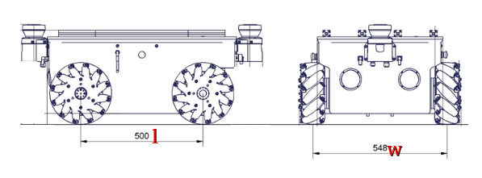

# Wheeled mobile robots
Wheeled mobile robots 에는 Holonomic (omnidirectional) 또는 nonholonomic 방식이 있다.   


Holonomic: omniwheels 또는 mecanum wheels 가 있다. 옆으로 이동이 가능하다 

Nonholonomic: 자동차, 전통적 방식의 휠 등이 있고, 옆으로 움직일 수가 없다


## Kinematic model
4바퀴의 mecanum 의 모바일 로봇 kinematic model  


𝑢 는 휠의 driving 속도의 대한 vector  
𝑟 은 휠의 radius   
𝑙 과 𝑤 은 샷시 (chassis)의 dimensions   
𝑙 은 휠베이스라고 생각하면 되고, front휠의 중점에서 rear휠의 중점까지 거리   
𝑤 정면에서 봤을 때 휠과 휠 사이의 거리    
𝛾 는 슬라이딩을(free sliding occurs) 하는 각도   
free sliding은 diagonal 움직임. 즉, 대각선으로 움직이는 것을 의미하는 듯 하다   




파이썬 코드로 키네마틱을 function으로 구현

```py
def twist2wheels(wz, vx, vy):
    l = 0.500/2
    r = 0.254/2
    w = 0.548/2
    H = np.array([[-l-w, 1, -1],
                  [ l+w, 1,  1],
                  [ l+w, 1, -1],
                  [-l-w, 1,  1]]) / r
    twist = np.array([wz, vx, vy])
    twist.shape = (3,1)
    u = np.dot(H, twist)
    return u.flatten().tolist()

# numpy등이 필요
import rospy, numpy as np
from std_msgs.msg import Float32MultiArray

rospy.init_node('make_turn', anonymous=True)
pub = rospy.Publisher('wheel_speed', Float32MultiArray, queue_size=10)
rospy.sleep(1)

u = twist2wheels(wz=1.5, vx=1, vy=0)
msg = Float32MultiArray(data=u)
pub.publish(msg)
rospy.sleep(1)
stop = [0,0,0,0]
msg = Float32MultiArray(data=stop)
pub.publish(msg)

```

예제에 사용된 로봇의 휠 지름은 254mm, 위의 그림을 참고하자..

twist2wheels() 함수에 wz 는 angular.z 의 속도 , vx은 (velocity) linear.x , vy는 linear.y 의 값을 넘겨주게 되고   

리턴 값으로 4개 바퀴의 속도인 u가 나오게 된다. (4개 요소 값)   

> l, r, w를 2로 나눈것은.. 잘 모르겠다. 한쪽이 더 있어서?!


