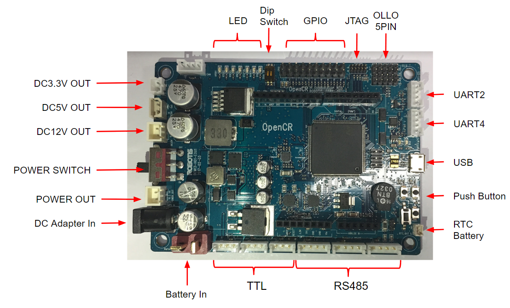

# UART

OpenCR 에는 UART 포트가 2개가 있다  
RS485 3개 (병렬), TTL 포트 등...  

UART는 각각, (* 위에서부터) (첫 번째)UART2, (두 번째)UART4는 로 매핑이 되어 있어서   
Serial2, Serial4 로 사용을 할 수가 있다   

선 연결은 각각 (* 위에서부터)  
G  []  
V  []  
R  []  
T  []  





예:
```cpp
#define SERIAL Serial2

volatile int nCount=0;

void setup() {
  SERIAL.begin(115200);
}

void loop() {
  SERIAL.println("Hello World!!");
  SERIAL.print("nCount : ");
  SERIAL.println(nCount++);
  
  delay(1000);
}
```

