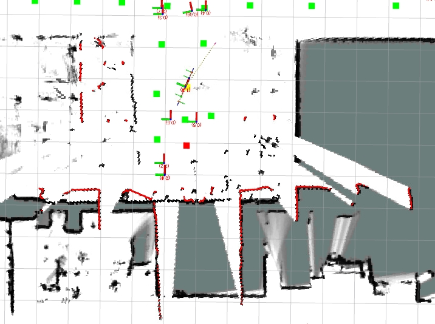
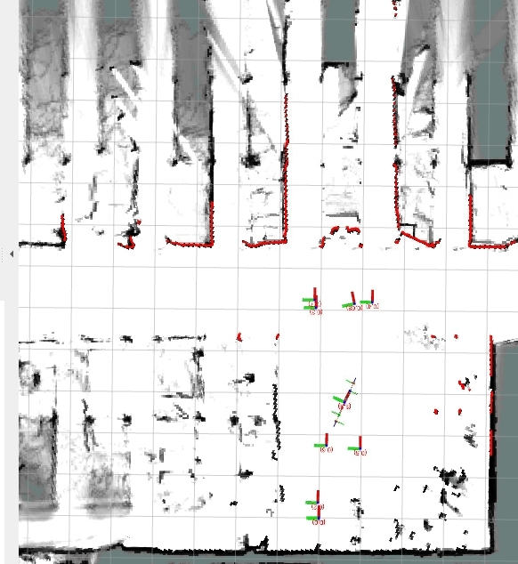
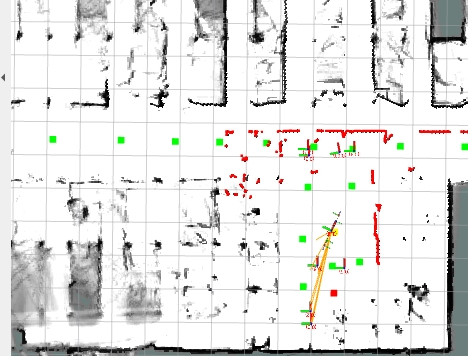
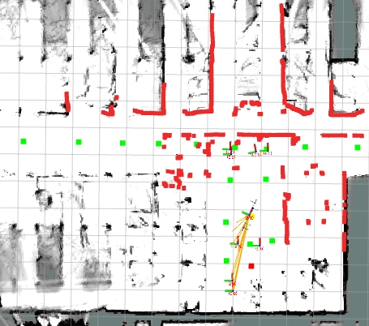
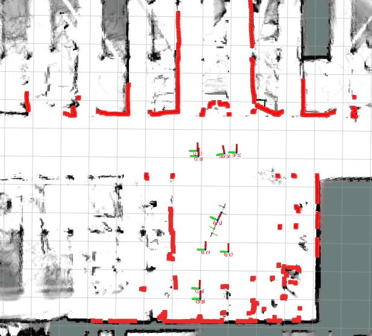

# rplidar 위치 

## FRONT
rplidar 는 로봇의 base_link 의 위치에 따라 lidar의 frame 에서 값을 rpy에서 yaw 값을   
3.1415 로 해줘야 한다. 
> 물론 라이다(제품) 마다 다를 수 있다. 일단 rplidar에 한정

앞 쪽의 라이다의 프레임 yaw 를 0.0 으로 했을 경우  


물론 프레임의 위치가 다르다고 해서 라이다가 스캔을 못하는 것은 아니지만 로봇 TF가 잘못 반영되므로 잘 설정 해야한다.  
위와 같은 경우에는 라이다의 실제 위치와는 다르게 스캔이 표시되고 있다.   


앞 쪽의 라이다의 프레임 yaw 를 3.1415 으로 했을 경우    
  


## REAR
rplidar 는 로봇의 base_link 의 위치에 따라 lidar의 frame 에서 값을 rpy에서 yaw 값을   
0.0 로 해줘야 한다.   

front 와 마찬가지로 뒤쪽의 경우도 마찬가지이다. yaw를 3.14로 하면 뒤쪽 라이다가 로봇의 앞쪽으로 표시 된다.

  


이렇게 해서 두 개의 라이다를 합쳐서 보면   
  
두 개의 scan 이 합쳐서 보여지면 이상한 스캔이 나오게 되어서  
어디가 잘못 되었는지 확인하기 어렵게 되므로 스캔 하나씩 확인해서 tf에 확인할 필요가 있다.  


## 2 scan
앞/뒤로 스캔을 사용했을 때 라이다의 프레임을 로봇의 앞을 스캔 할 경우는 yaw 3.14  
로봇의 뒤쪽을 스캔은 yaw 0.0

  

꼭 정해진 값은 아니겠지만 정리 차원에서 남겨 본다.  

### 참고 urdf
```xml
<joint name="front_laser_link_joint" type="fixed">
    <parent link="base_link" />
    <child link="front_laser_link" />
    <origin xyz="0.2 0 0.2" rpy="0 0 3.141592" />
  </joint>

  <joint name="rear_laser_link_joint" type="fixed">
    <parent link="base_link" />
    <child link="rear_laser_link" />
    <origin xyz="-0.2 0 0.2" rpy="0 0 0" />
  </joint>

```

