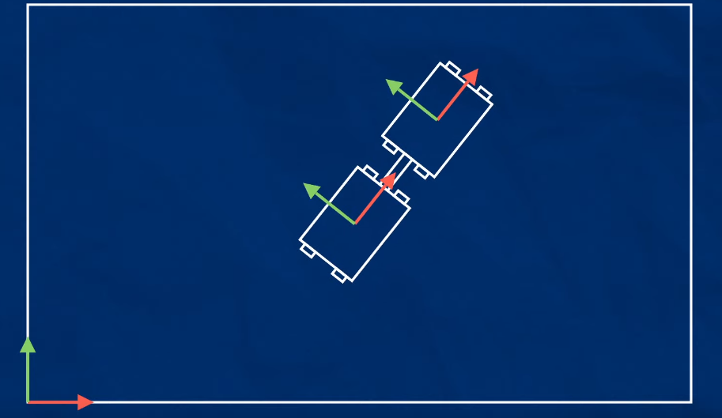
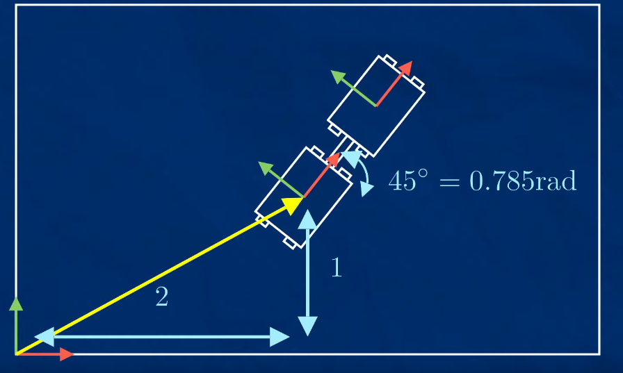

# tf basic
여기저기 정리가 안되어 있어서 문제 ;;;

static tf  

특정 링크와 붙어 있는 경우에 사용할 수가 있고   
항상 기준이 되는 world 프레임이 있게 된다   

그래서 x,y 방향으로 이동 및 방향이 나오게 된다  




여기에 방향 정보 까지 만들어지면   




base_link 은 x=2, y =1 에 방향은 45도 
```xml
<joint name="joint_link1" >
    <parent link="world">
    <child link="base_link">
    <origin xyz="2 1 0" rpy="0 0 0.78">
</joint>
```
방향이 틀렸을 수도 있는데 대략 이런식으로 포현이 될 듯  

그리고 여기에 static으로 두 번째에 있는 링크를 base_link에 붙이면 static tf가 된다  . 같은 뱡향 같은 움직임을 보이게 된다   


