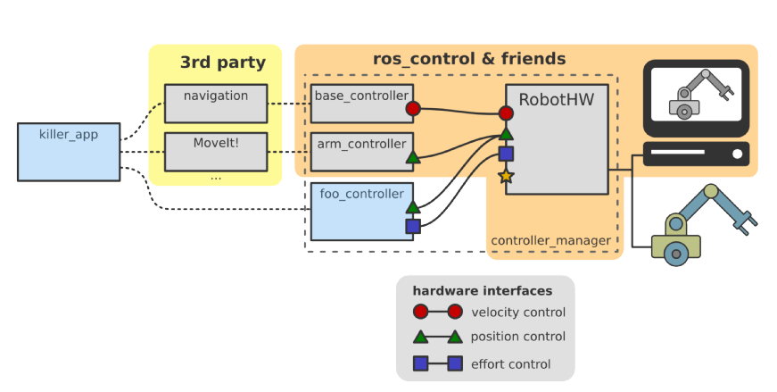

# joint ROS Control

컨셉

- Robot Hardware Interface: real hardware와 연결할 수 있게 해준다.  
- Robot Controllers: actuator 를 컨트롤 하게 되는 actual controllers   
- Control Manager: handles the load/unload and execution of the controllers and allow the proper communication between the robot Hardware Interface and the Robot Controllers  (Robot Hardware Interface와 Robot Controllers를 연결해준다)

controller에서 작동하는 hardware interfaces에는 
velocity control, position control, effort control 3가지가 있다   


gazebo 시뮬레이션 상에서는 Robot Hardware Interface만 바뀌게 된다   
Gazebo Ros Control Plugin에서 communication하게 된다   

## 설치
```
sudo apt install ros-noetic-ros-controllers
```


## Ros Controllers
컨트롤러에는 effort_controllers, position_controllers, velocity_controllers, joint_state_controller  

- effort_controllers: joinst_effort_controller, joint_position_controller, 또는 joint_velocity_controller 를 input 으로 사용  

- position_controllers: joint_position_controller 포지션 벨류를 input으로 받는다 

- velocity_controllers: joint_velocity_controller velocity 값을 input으로 받음 

- joint_state_controller :  /joint_states 토픽으로 joints 의 state를 퍼블리싱 한다


## Hardware Interface
urdf 파일에   
하드웨어 인터페이스를 추가해주기 위해서 gazebo에서 transmissions 를 추가해준다   

hardwared interface 에서 joint 별로 transmissions 를 지정해 줄 수가 있고   

위의 ros controllers 에서 나온 controllers 방식을 선택한다 

예
```xml
... 생략
<joint name="rigt_wrist_joint">
... 생략
</joint>

   <transmission name="tran11">
        <type>transmission_interface/SimpleTransmission</type>
        <joint name="right_wrist_joint">
            <hardwareInterface>EffortJointInterface</hardwareInterface>
        </joint>
        <actuator name="motor11">
            <hardwareInterface>EffortJointInterface</hardwareInterface>
            <mechanicalReduction>1</mechanicalReduction>
        </actuator>
    </transmission>
```


## Ros Controller 
`libgazebo_ros_control.so` 플러그인을 사용하는 코드를 urdf에 추가

```xml
<gazebo>
    <plugin name="gazebo_ros_control" filename="libgazebo_ros_control.so">
        <robotNamespace>/my_robot</robotNamespace>
        <robotSimType>gazebo_ros_control/DefaultRobotHWSim</robotSimType>
    </plugin>
</gazebo>
```

여기에서 사용하는 robotNamespace는 토픽앞에 생성이 되기도 하고, yaml 파일로 설정할 ns와도 관련이 있게 된다 




## config 파일 정의


## 퍼블리쉬 command
터미널에서  
rostopic pub /로봇_네임스페이스/controller_이름/command std_msgs/Float64 "data: 0.5"

이렇게 주면 position으로 되어 있는 controller 의 joint가 움직이게 된다 

```
rostopic pub /my_robot/left_wheel_joint_controller/command std_msgs/Float64 "data: 10.0" 
```

## ..중간 결론?
아무래도 joint의 position을 이용해서 하는 방식에서는 잘 되는 듯 하나   
velocity를 이용해서 하는 방법은 작동하지 않는 듯 하다   

좀 더 연구가 필요   

controller를 position 으로 사용하고 하는 선에서 적당히 사용할 수 있을 듯 하다   

물론 joints_states 토픽으로 position과 velocity 값이 다 나오기는 하지만   
gazebo 상에서 플러그인 문제인지? (메카넘에 맞는것을 사용해야하는 듯??) 값은 나오지만 별 소득은 없는 듯 하다   

~~로봇 팔의 joint만 사용하는 것 이라면 position으로도 가능하니,   
그냥 *joint_state_publisher* 노드로  joint_states 토픽만 해도 커버가 되니~~

> *joint_state_publisher* 노드만 실행 했을 경우에는 rviz에서는 잘 된다.   
특히 gui 노드, 즉 joint_state_publisher_gui 노드로 실행하면 rviz에서는 잘 되지만 gazebo에서는 안되는 것으로 봐서는  
결국은 controller를 넣어줘야하는 듯 하다

~~일단은 yaml파일로 파라미터 로드해서 일일히 joint 정의해주고 하는 것을 안해도 될 듯 하다~~  

gazebo 컨트롤러와 아마 연결이 안되서 그러는 듯 하다. joint_states의 토픽의 position 값은 변경이 되지만  
gazebo의 모델은 움직이지 않음 


## 정리하자면..

gazebo를 empty 월드로 해주는 런치파일에 include를 따로 런치파일을 추가하거나, 직접 입력해주는데   

이때 rosparam을 이용해서 yaml 파일을 load

```xml
런치파일 일부분
 <rosparam command="load"
                file="$(find myrobot_description)/config/controller.yaml" />
        
    <!-- load the controller -->
    <node name="controller_spawner" pkg="controller_manager" type="spawner"
                respawn="false" output="screen"
                ns="my_robot"
                args="joint_state_controller
                        front_joint_1_controller " />
```

그리고 controller_manager 의 spawner 노드를 실행 시키는데   
이때 **args로 넘겨주는 컨트롤러 이름이 yaml 파일에서 설정한  컨트롤러 이름과 같아야** 한다   

위에서 args 로 front_joint_1_controller 라고 했다면 이 이름이 해당 컨트롤러의 이름과 같아야 함

이제 yaml파일에서 
```yaml
## 공통 모든 joint의 state를 퍼블리쉬 해준다, 단, ns(네임스페이스)에 붙여서 퍼블리싱
joint_state_controller:
    type: joint_state_controller/JointStateController
    publish_rate: 30

  ## 이 부분이 같아야 한다 (해당 joint의 컨트롤러 이름 - 이름은 변경가능하고 매칭만 되면 된다)
front_joint_1_controller:
    type: effort_controllers/JointVelocityController  
    joint: front_joint_1  ## urdf의 joint 이름
    pid: {p: 100.0, i: 0.01, d: 10.0 }

# 더 joint를 담당하는 controller를 설정
```


또한 ns로 지정한 `ns="my_robot"` 같은 경우에는 gazebo 관련 plugin을 사용하는 urdf 파일에서   
```xml
<gazebo>
    <plugin name="gazebo_ros_control" filename="libgazebo_ros_control.so">
        <robotNamespace>/my_robot</robotNamespace>
        <robotSimType>gazebo_ros_control/DefaultRobotHWSim</robotSimType>
    </plugin>
</gazebo>
```
이 처럼 다른 태그들은 다 디폴트이고 name스페이스를 맞춰줘야 한다 


## controller 타입

위의 yaml 파일에서 지정했던 타입을   
그 밖에 controller 타입에서  velocity가 아닌
`effort_controllers/JointPositionController` 로 사용할 수 있다   

이때 또한 urdf 파일에서 transmission 태그로 지정했던 부분에서도 joint 내의 hardwareInterface를 지정하는데  

```xml
<transmission name="my_wheel_trans">
    <type>transmission_interface/SimpleTransmission</type>
    <joint name="${prefix}_${suffix}_wheel_joint" >
        <hardwareInterface>hardware_interface/PositionJointInterface</hardwareInterface>
        
        <!-- 그 밖에 hardwareInterface 중에서 다른 interface지정할 수도 있다. !! -->
        <!-- <hardwareInterface>hardware_interface/VelocityJointInterface</hardwareInterface> -->
        <!-- <hardwareInterface>hardware_interface/EffortJointInterface</hardwareInterface> -->
        
    </joint>
    <actuator name="${prefix}_${suffix}_wheel_motor">
        <!-- <hardwareInterface>위의 joint에서 지정한 hardwareInterface와 같은 놈으로 지정해준다</hardwareInterface> -->
        <hardwareInterface>hardware_interface/PositionJointInterface</hardwareInterface>
        <mechanicalReduction>1</mechanicalReduction>
    </actuator>
</transmission>

```


 현재 까지는  
  `<hardwareInterface>hardware_interface/EffortJointInterface</hardwareInterface>` 로 만든 후에    

  config에서  type을  
  type: effort_controllers/JointPositionController   
  type: effort_controllers/JointVelocityController  

  지정해주면 잘 됨. 

  > gazebo_plugin 이 잘 지정되어 있는지도 확인해야함 (libgazebo_ros_control.so)

  