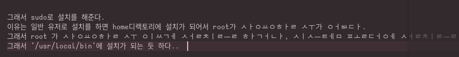
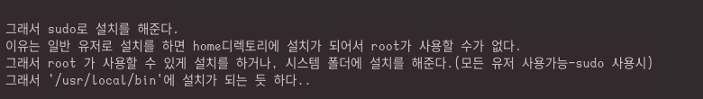

# 한글이 모음 자음 별로 모두 띄어지는 현상

> vscode 관련.md 파일에도 있는 내용임..  

위의 ubuntu case 처럼 Droid Sans Fallback 폰트가 되어 있으면 한글 자음 모음이 분리가 되어 있는데  
하지만 아예 처음부터 vscode 설정에 **Droid Sans Fallback 자체가 없다**

Rocky Linux 8.5 에서는 전혀 한글 자음 모음 분리가 없었는데 이상하다   
입력기는 ibus-hangul을 사용하고 있었고, 영어에서 한글로 바뀌어서 쓴 부분 특히 '가'로 시작하면   
뒤의 한글 자음 모음이 분리가 됨   

예를 들어 <한글 자음 분리 현상 예>     


이런식으로 나와야 하는데 영어로 쓰다가 한글로 바뀌어서 된 부분에서 위와 같은 현상 발생   
무조건 영어 문장 뒤에 한글로 가 로 시작하면 뒤의 한글은 다 분리가 되었다, 
어떤 문장이든.. 특이하게도 '가' 아닌 '기, 긴, 간..' 등으로 하면 분리가 안됨.  물론 다른 나,다,라... 는 상관이 없었음  

입력할 때에는 문제가 전혀 없고, vscode에만 저런 현상이 발생하고, gedit 등으로 파일을 열면 정상적으로 보임   

> vscode에서 Droid Sans를 사용 안하게 font 설정에서 제거했지만,  
fedora, rocky linux 등에서 발생하는 듯 하다.(우분투에서는 설정만으로 가능했던 것 같다..)  

> (참고로 vscode도 rpm 버전으로 설치한 1.75.1... el7.x86_64 버전,  
dnf 로 repo 추가해서 설치한 1.76.0-1677667581.el7.x86_64 버전에서도 같은 현상,   
Rocky Linux 커널 업그레이드 등.. 소용없음)

입력기를 바꿔볼까도 했지만 vscode에만 위와 같은 현상이 발생하기도 해서..   
결국은 또 2~3시간을 허비한 후에 Droid 폰트 전체를 없애기로 함     

이동 후 삭제 (필요하다면 백업)
```
cd /usr/share/fonts/
sudo tar Jcvfp google-droid-sans-backup.tar.xz google-droid-sans-fonts/
sudo rm -rf google-droid-sans-fonts/
```

로그아웃 등도 필요없이 vscode를 다시 보면  
해당 문제가 해결이 됨! 한글 자음 분리되는 현상 없이 잘 나온다!! 굿

> 바로 안될 경우 로그아웃 하면 잘 된다. Fedora 38 도 잘 됨

<한글 자음 분리 현상 해결 예>   
