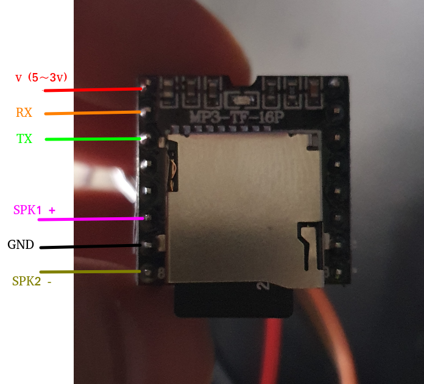
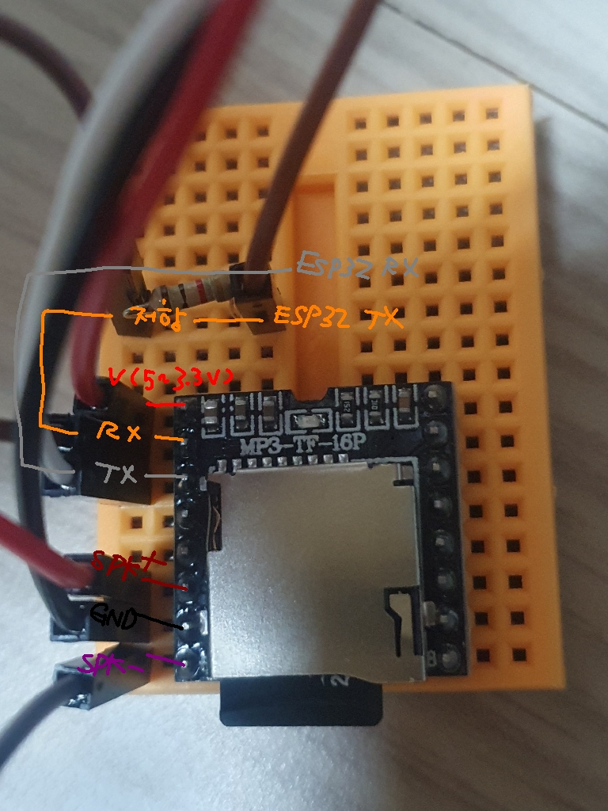

# mp3 모듈 사용
라이브러리는 `dfrobot/DFRobotDFPlayerMini` 사용  

mp3 모듈에서 rx, tx로 연결해서 사용 

esp32 같은 경우에는 16, 17 로 연결해주고  (rx2, tx2)

17번 tx 로 연결은 크로스로 모듈의 rx에 연결해주는데 이때 1k 저항을 달아준다  
eps32의 rx ---> mp3모듈의 tx  
esp32의 tx ---> mp3모듈의 rx  

> esp32는 3.3v 라서 저항을 안 달아도 된다고 하지만   
이번 케이스에는 스피커에서 지지직 거리는 소리가 남, 그래서 저항을 달아주니  
괜찮아졌다. 5v를 사용할 경우에는 저항을 달아야한다고 한다   
rx ,tx 쪽 번갈아 가면서 테스트 해본다. 2개 달아야 하는지는 잘 모르겠다

그리고 하드웨어시리얼을 이용해서 연결
```cpp
#define RX 16
#define TX 17

Serial.begin(9600);
Serial1.begin(9600, SERIAL_8N1, RX, TX);
```





