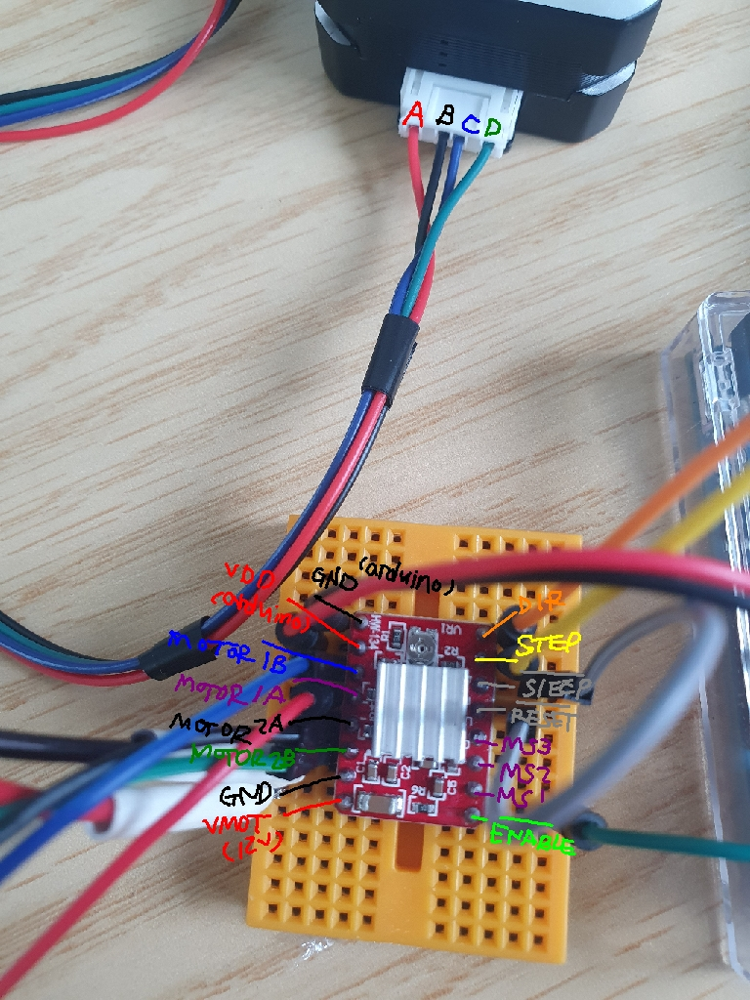

# step motor A4988 driver

일단 간략히 정리, 먼저 핀맵 부터...  

SLEEP, RESET, ENABLE 핀은 ground을 입력했을 때 작동한다.  
그래서 표시 위에 '작대기?'가 - 가 표시되어 있다. 

MS1,2,3 는 FULL STEP, HALF STEP, MICRO STEP 등을 정하는 것인데 아직 못 해봄.   

모터 마다 스펙이 다를 수 있겠지만, 일단 보급형 NEMA 17 모터의 경우   
A,B,C,D 선이 4개 나오는데, A and C, B and D 가 하나의 세트로 생각하면 된다.  

그래서 모터 드라이버에 연결할 때에 ,  
1A, 1B 로 모터의 A,C 로 연결 (빨강, 파랑)
2A, 2B 로 모터의 B,D 로 연결 (검정, 초록)

