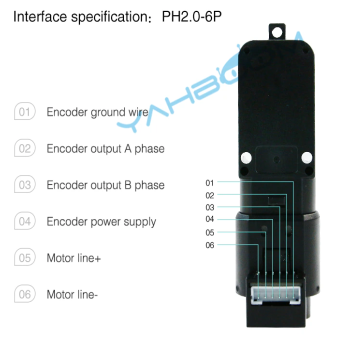

# tt motor 13
작동 전압 6v (6~12v)  정격 전류 0.3A, 토크 1.2N.m 최대속도 16000 + 5% rpm  
13라인 인코더  
아두이노 신호는 5v

reduction ratio 1:45

The motor rotates one circle and outputs 13 pulses in single phase,  
with a reduction radio of 1:45. The Maximum output of the motor output shaft  
rotates one circle (45 * 13 * 4) 2340 counts. Thephase difference of AB two-phase  
output pulse signal is 90 degrees, which can detect the rotation direction of the motor

[깃허브 다운](https://github.com/YahboomTechnology/Motor-with-Encoder)

