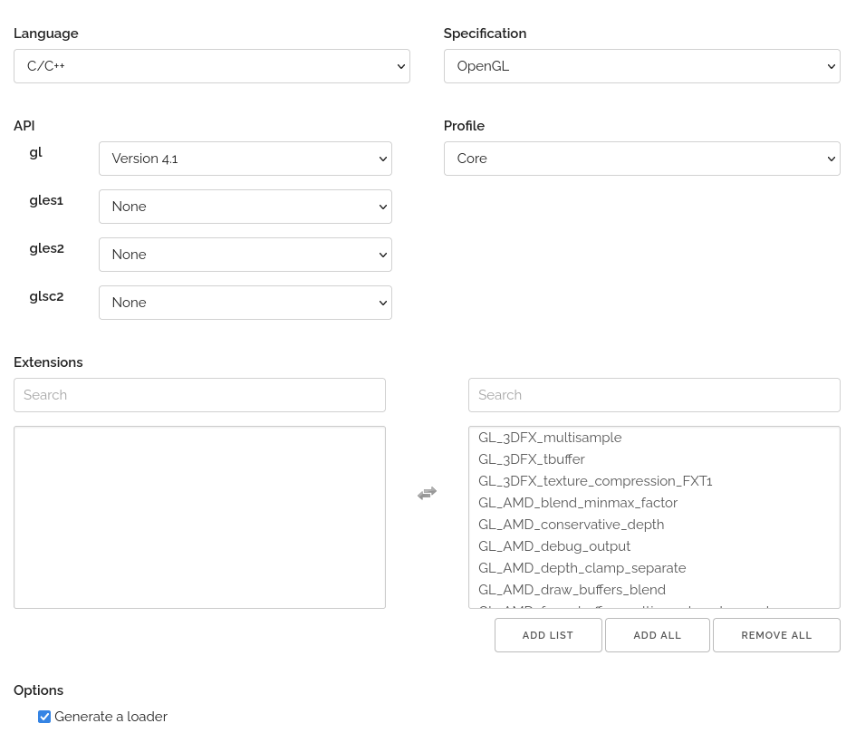

# open gl
OpenGL loading library

glad(Multi-Language GL/GLES/EGL/GLX/WGL Loader-Generator)  

구글 검색키워드: glad opengl

[사이트 Glad](https://glad.dav1d.de/)   
위 사이트에서 Language, 등을 정의

opengl을 사용할 수 있게 헤더파일 등을 만들어준다   

스샷 처럼 선택해주면 된다  

API 부분에서 Version 4.1 정도면 windows, linux, mac 에서도 다 잘되는 버전이라고 한다.   
버전을 선택하면 사용할 수 있는 Extensions가 나오는 데 ADD ALL을 눌러서 다 선택을 해주고   

Profile은 Core로 선택해준다   

그리고 Generate a loader에 체크가 되어 있는 상태에서 Generate 버튼을 눌러주면 zip파일이 만들어 진다 

다운을 받은 후에 원하는 디렉토리에 압축을 풀어주면 glad.h, glad.c 가 있다   

