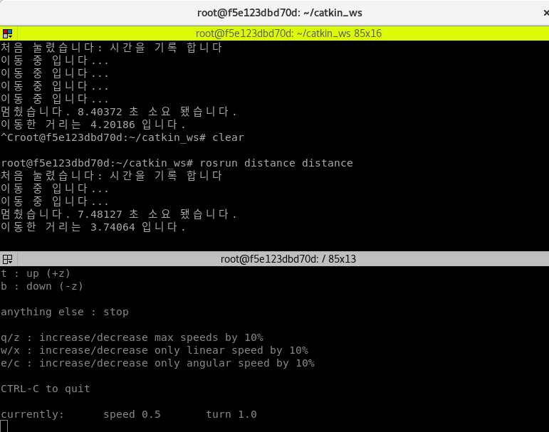
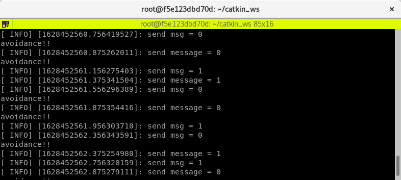
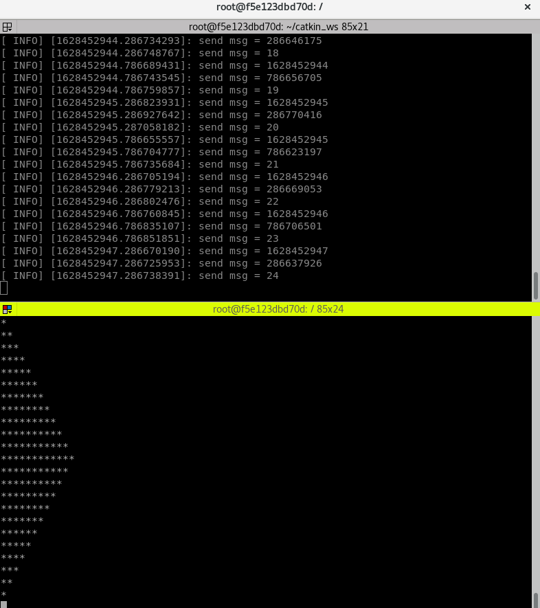
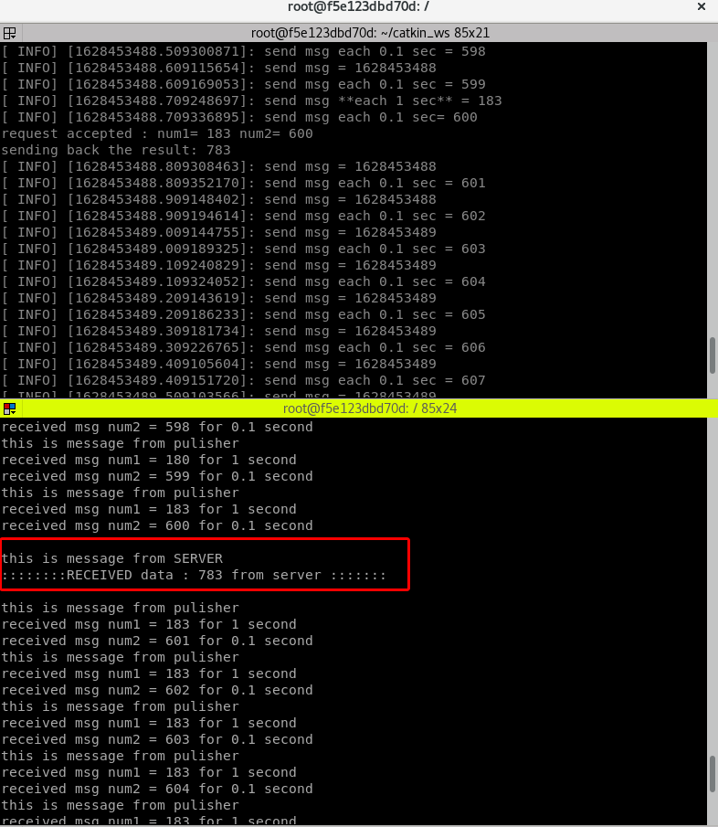
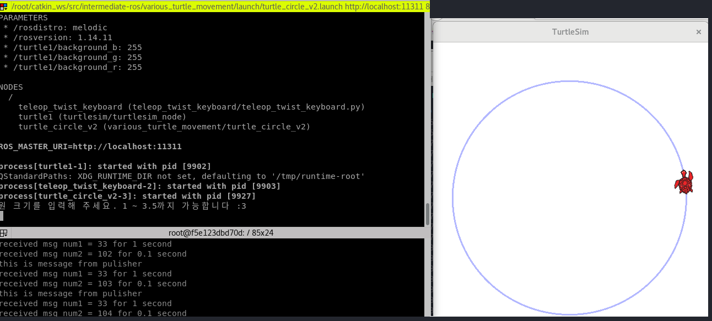
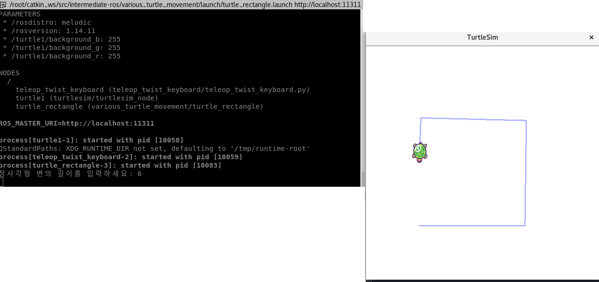
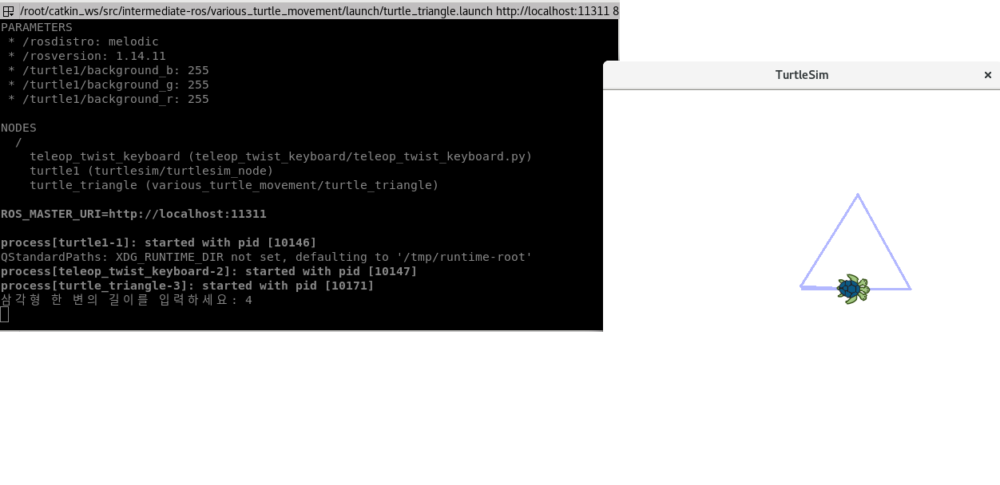
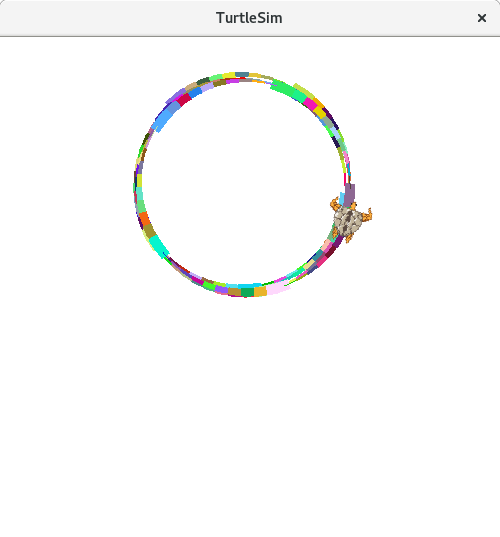
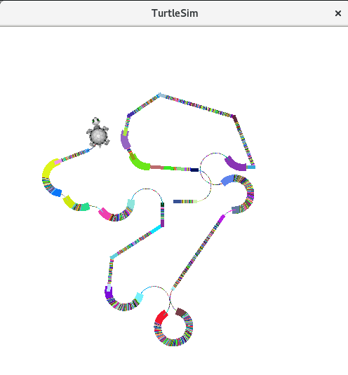

# ROS 활용 미니 프로젝트
ROS를 활용하는 Toy프로젝트로 ROS에 대해서 공부하면서 다양하게 topic들을 활용해보고   
publisher와 subscriber로 통신을 하는 노드와 패키지를 만들었습니다.

특히 turtlesim을 이용해서 거북이를 움직이게 하고 조작할 수 있습니다.

 

## 패키지 
distance, double_check, star_pubsub, yh_topic_service, various_turtle_movement

 

## distance 패키지 주요기능
- 거리를 구하는 노드
- cmd_vel을 이용해서 키보드가 눌렸을 때,  
즉 움직임이 시작되었을 때로부터 다시 멈추는 순간까지 얼마나 움직였는지 계산하는 노드 입니다.

 

 

## double_check 패키지 주요기능
- 2개의 노드에서 check_pusb1, check_pub2 에서 각각 0.5초, 0.1초 roop_late로 퍼블리싱을 하게 되는데  
    이를 check_sub 노드에서 subscribed를 해서 각각 겹치는 타이밍에 avoidance를 출력하는 노드 입니다.

 

 

## star_pubsub 패키지 주요기능
- 0.5 초씩 발행되는 토픽 topic_star을 구독을 해서 별을 그리는 노드 입니다.  

 

 

## yh_topic_service 패키지 주요기능
- rosservice를 이용해서 서버와 클라이언트로 서비스를 할 수 있는 노드 입니다.  
- 10초마다 service 요청을 하고 클라이언트에게 각 숫자를 더해서 응답하게 되는 노드 입니다.

 

 

# various_turtle_movement 패키지 주요기능
- turtle_circle, turtle_rectangle, turtle_triangle, turtle_pen_v1 다양한 노드에서  
  각각 원형, 사각형, 삼각형 그리고 랜덤 이동을 하는 프로그램 입니다
- 입력을 받아 거북이 움직임이 시작됩니다. (turtle_circle_v1 제외)
- turtle_pen 노드는 거북이의 궤적을 표시해줍니다. 랜덤하게 색을 표시함
- turtle_pen_v2 노드는 키보드로 거북이의 움직임을 제어 합니다. (u,i,o 키 등..)

1. turtle_circle node   

 

2. turtle_rectangle node   

 

3. turtle_triangle node    

 

4. turtle_pen node   

 

 

# 개발환경 
Utuntu 18.04, ROS melodic, Docker

우분투 바이오닉 비버 LTS버전에서 작동 합니다. 
만약 다른 리눅스 배포판을 사용한다면 docker로 가상환경을 만들 수 있습니다.

 

# 사용언어
C++

 

## 깃허브
깃허브에서 소스코드를 확인할 수 있습니다.

[깃허브에서 확인하기](https://github.com/terrificmn/intermediate-ros.git)

